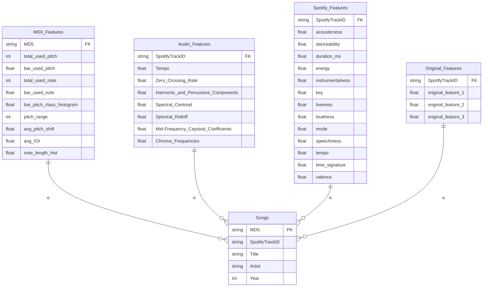

# MIDI / Audio Feature Database

each chunk from the song has a features obtained both MIDI and Audio sample

init

```shell
psql songs < tables.sql
```

## ER Diagram



```
songs=# \dt
             List of relations
 Schema |       Name       | Type  | Owner
--------+------------------+-------+--------
 public | audio_features   | table | atsuya
 public | midi_features    | table | atsuya
 public | song             | table | atsuya
 public | spotify_features | table | atsuya

```

## Audio Features

With `Librosa`, which is one of most useful sound library for Pythonists, it's able to extract several kinds of audio features as `numpy` array

- Tempo(BPM)
- Zero Crossing Rate
- Harmonic and Percussive Components
- Spectral Centroid
- Spectral Rolloff
- Mel-Frequency Cepstral Coefficients(MFCCs)
- Chroma Frequencies

## Spotify Features

Spotify API gives audio features for each track, response is like below

```json
{
  "acousticness": 0.00242,
  "analysis_url": "https://api.spotify.com/v1/audio-analysis/2takcwOaAZWiXQijPHIx7B\n",
  "danceability": 0.585,
  "duration_ms": 237040,
  "energy": 0.842,
  "id": "2takcwOaAZWiXQijPHIx7B",
  "instrumentalness": 0.00686,
  "key": 9,
  "liveness": 0.0866,
  "loudness": -5.883,
  "mode": 0,
  "speechiness": 0.0556,
  "tempo": 118.211,
  "time_signature": 4,
  "track_href": "https://api.spotify.com/v1/tracks/2takcwOaAZWiXQijPHIx7B\n",
  "type": "audio_features",
  "uri": "spotify:track:2takcwOaAZWiXQijPHIx7B",
  "valence": 0.428
}
```

Sound features

- acousticness
- danceability
- duration_ms
- energy
- instrumentalness
- key
- liveness
- loudness
- mode
- speechiness
- tempo
- time_signature
- valence

## MIDI Features

extracted using mgeval, which implemented several symbolic features explained in the Paper: [MGEval - An objective evaluation toolbox for symbolic domain music generation](https://richardyang40148.github.io/TheBlog/post_mgeval.html)

features (introduced [here](https://github.com/RichardYang40148/mgeval/blob/master/mgeval/documentation.md))

- `total_used_pitch` (Pitch count):
- `bar_used_pitch` (Pitch count per bar)
- `total_used_note` (Note count):
- `bar_used_note` (Note count per bar).
- `total_pitch_class_histogram` (Pitch class histogram):
- `bar_pitch_class_histogram` (Pitch class histogram per bar):
- `pitch_class_transition_matrix` (Pitch class transition matrix):
- `pitch_range` (Pitch range):
- `avg_pitch_shift` (Average pitch interval):
- `avg_IOI` (Average inter-onset-interval):
- `note_length_hist` (Note length histogram):
- `note_length_transition_matrix` (Note length transition matrix):

## Original Features

If needed, additional feature table can be designed to make the interface app more interpretable.
